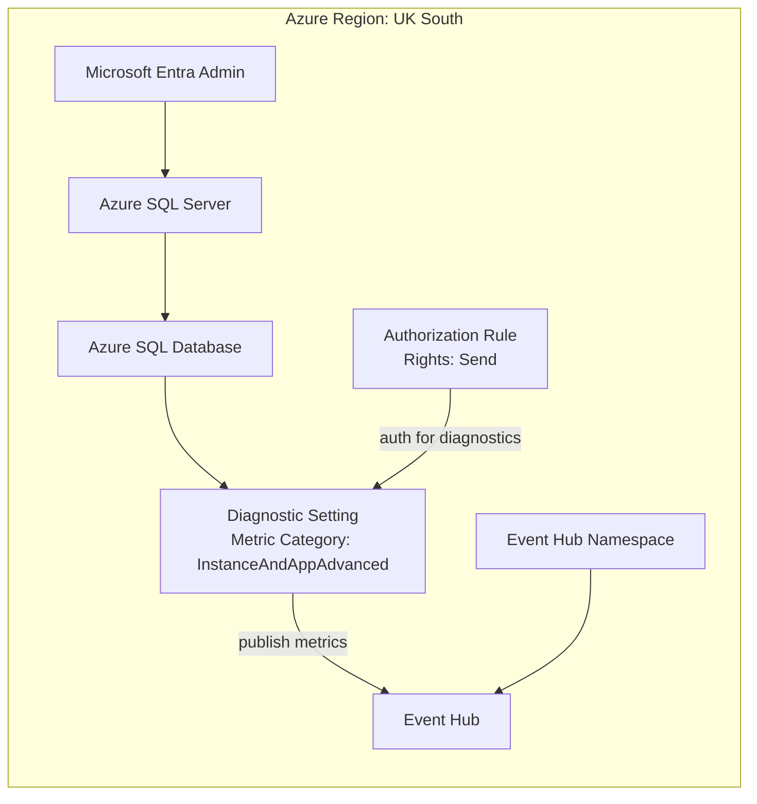

# SQL Database to Event Hub Diagnostic Setting

This repository provides a Bicep template that deploys an Azure SQL Server and Database in UK South, configures Entra-only authentication, and sends only the SQL database diagnostic metric category (`InstanceAndAppAdvanced`) to Event Hub.

Deployment in this repo is **resource-group scoped** (`az deployment group create`).

## What gets deployed

- Azure SQL logical server (`Microsoft.Sql/servers`)
- Azure SQL database (`Microsoft.Sql/servers/databases`)
- Entra administrator + Entra-only authentication on SQL Server
- Event Hub namespace, Event Hub, and namespace authorization rule (`Send`)
- Database diagnostic setting targeting Event Hub

## Architecture



## Prerequisites

- Azure CLI logged in (`az login`)
- Subscription where you can create resource groups
- Permission to assign SQL Entra admin and create Event Hub resources

## Codespaces

- This repo includes a dev container config at `.devcontainer/devcontainer.json`.
- On Codespace create/rebuild, `.devcontainer/post-create.sh` installs Azure CLI (`az`) automatically.
- If you already have an open Codespace, run **Rebuild Container** to apply it.

## Deploy

Run from this repository folder:

```bash
export AZURE_LOCATION="uksouth"
export RG_NAME="<your-resource-group>"
export ENTRA_ADMIN_OBJECT_ID="<entra-object-id-guid>"
export ENTRA_ADMIN_LOGIN="<admin-upn-or-display-name>"

# Optional: override tenant used for SQL Entra admin assignment
# export ENTRA_ADMIN_TENANT_ID="<tenant-guid>"

./deploy.sh
```

Equivalent manual commands:

```bash
az group create --name "$RG_NAME" --location "$AZURE_LOCATION"

az deployment group create \
    --resource-group "$RG_NAME" \
    --template-file main.bicep \
    --parameters \
        location="$AZURE_LOCATION" \
        entraAdministratorLogin="$ENTRA_ADMIN_LOGIN" \
        entraAdministratorObjectId="$ENTRA_ADMIN_OBJECT_ID" \
        entraAdministratorTenantId="$ENTRA_ADMIN_TENANT_ID"
```

## Parameters

- `location` (default: `uksouth`)
- `sqlServerName` (default: generated from resource group)
- `sqlDatabaseName` (default: `sqldb-app`)
- `entraAdministratorLogin` (required)
- `entraAdministratorObjectId` (required)
- `entraAdministratorTenantId` (default: current tenant)
- `sqlDatabaseSkuName` (default: `S0`)
- `eventHubNamespaceName` (default: generated from resource group)
- `eventHubNamespaceSku` (default: `Standard`; allowed: `Standard`, `Premium`)
- `eventHubNamespaceCapacity` (default: `1`)
- `eventHubName` (default: `sql-db-diagnostics`)
- `eventHubPartitionCount` (default: `2`)
- `eventHubMessageRetentionInDays` (default: `1`)
- `eventHubAuthorizationRuleName` (default: `sql-diag-send`)
- `diagnosticSettingName` (default: `sql-db-diag-to-eventhub`)

## Notes

- SQL authentication is disabled (`azureADOnlyAuthentication = true`).
- Diagnostic metric category is set to `InstanceAndAppAdvanced`.
- Event Hub resources are created and wired automatically by the template.

## Verify data is arriving in Event Hub

After deployment, generate some SQL activity, then check Event Hub ingress metrics.

Find `event-hub-resource-id` (from deployment outputs):

```bash
export DEPLOYMENT_NAME="$(az deployment group list -g "$RG_NAME" --query "[0].name" -o tsv)"
export EVENT_HUB_RESOURCE_ID="$(az deployment group show \
    -g "$RG_NAME" \
    -n "$DEPLOYMENT_NAME" \
    --query "properties.outputs.eventHubResourceId.value" \
    -o tsv)"

echo "$EVENT_HUB_RESOURCE_ID"
```

Alternative lookup (resource query):

```bash
az resource list \
    --resource-group "$RG_NAME" \
    --query "[?type=='Microsoft.EventHub/namespaces/eventhubs'].id | [0]" \
    --output tsv
```

Query incoming Event Hub metrics:

```bash
az monitor metrics list \
    --resource "$EVENT_HUB_RESOURCE_ID" \
    --metric "IncomingMessages" "IncomingBytes" \
    --interval PT1M \
    --aggregation Total \
    --output table
```

If `IncomingMessages` and `IncomingBytes` are increasing, diagnostics are being written to Event Hub.

## Troubleshooting

- Error: `Invalid value given for parameter Login` on `Microsoft.Sql/servers/administrators`
    - Cause: `entraAdministratorLogin` does not match the Microsoft Entra object, or tenant is incorrect.
    - Fix: use one of these values:
        - User: UPN (for example `alice@contoso.com`)
        - Group: display name
    - Tip: if the object is in a different tenant than your current CLI context, set `ENTRA_ADMIN_TENANT_ID` explicitly.