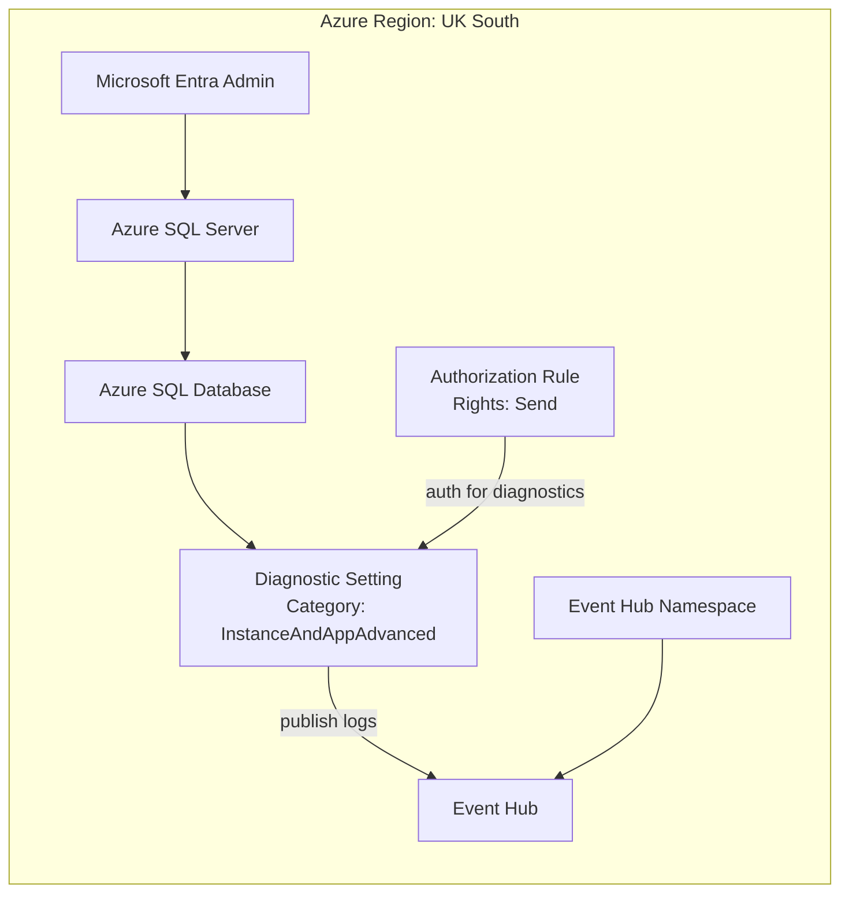

# SQL Database to Event Hub Diagnostic Setting

This repository provides a Bicep template that deploys an Azure SQL Server and Database in UK South, configures Entra-only authentication, and sends SQL database diagnostic logs (`InstanceAndAppAdvanced`) to Event Hub.

## What gets deployed

- Azure SQL logical server (`Microsoft.Sql/servers`)
- Azure SQL database (`Microsoft.Sql/servers/databases`)
- Entra administrator + Entra-only authentication on SQL Server
- Event Hub namespace, Event Hub, and namespace authorization rule (`Send`)
- Database diagnostic setting targeting Event Hub

## Architecture



## Prerequisites

- Azure CLI logged in (`az login`)
- Existing resource group in UK South
- Permission to assign SQL Entra admin and create Event Hub resources

## Deploy

Run from this repository folder:

```bash
export RG_NAME="<your-resource-group>"
export ENTRA_ADMIN_LOGIN="<admin-upn-or-display-name>"
export ENTRA_ADMIN_OBJECT_ID="<entra-object-id-guid>"

az deployment group create \
  --resource-group "$RG_NAME" \
  --template-file main.bicep \
  --parameters \
    entraAdministratorLogin="$ENTRA_ADMIN_LOGIN" \
    entraAdministratorObjectId="$ENTRA_ADMIN_OBJECT_ID"
```

## Parameters

- `location` (default: `uksouth`)
- `sqlServerName` (default: generated from resource group)
- `sqlDatabaseName` (default: `sqldb-app`)
- `entraAdministratorLogin` (required)
- `entraAdministratorObjectId` (required)
- `entraAdministratorTenantId` (default: current tenant)
- `sqlDatabaseSkuName` (default: `S0`)
- `eventHubNamespaceName` (default: generated from resource group)
- `eventHubNamespaceSku` (default: `Standard`; allowed: `Standard`, `Premium`)
- `eventHubNamespaceCapacity` (default: `1`)
- `eventHubName` (default: `sql-db-diagnostics`)
- `eventHubPartitionCount` (default: `2`)
- `eventHubMessageRetentionInDays` (default: `1`)
- `eventHubAuthorizationRuleName` (default: `sql-diag-send`)
- `diagnosticSettingName` (default: `sql-db-diag-to-eventhub`)

## Notes

- SQL authentication is disabled (`azureADOnlyAuthentication = true`).
- Diagnostic category is set to `InstanceAndAppAdvanced`.
- Event Hub resources are created and wired automatically by the template.