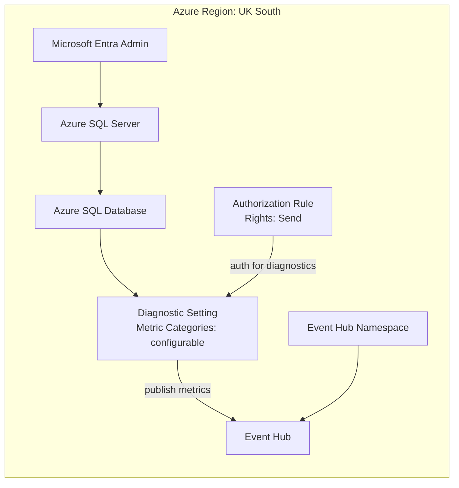

# SQL Database to Event Hub Diagnostic Setting

This repository provides a Bicep template that deploys an Azure SQL Server and Database in UK South, configures Entra-only authentication, and streams SQL database diagnostic metrics to Event Hub.

It also includes a Python script (`format_events.py`) that formats raw Event Hub JSON events into a readable table and can compare two event files to show which metrics were added or removed (e.g. when switching from `Basic` to `InstanceAndAppAdvanced`).

Deployment in this repo is **resource-group scoped** (`az deployment group create`).

## What gets deployed

- Azure SQL logical server (`Microsoft.Sql/servers`)
- Azure SQL database (`Microsoft.Sql/servers/databases`)
- Entra administrator + Entra-only authentication on SQL Server
- Event Hub namespace, Event Hub, and namespace authorization rule (`Send`)
- Database diagnostic setting targeting Event Hub

## Architecture



## Prerequisites

- Azure CLI logged in (`az login`)
- Subscription where you can create resource groups
- Permission to assign SQL Entra admin and create Event Hub resources

## Codespaces

- This repo includes a dev container config at `.devcontainer/devcontainer.json`.
- On Codespace create/rebuild, `.devcontainer/post-create.sh` installs Azure CLI (`az`) automatically.
- If you already have an open Codespace, run **Rebuild Container** to apply it.

## Deploy

Run from this repository folder:

```bash
export AZURE_LOCATION="uksouth"
export RG_NAME="<your-resource-group>"
export ENTRA_ADMIN_OBJECT_ID="<entra-object-id-guid>"
export ENTRA_ADMIN_LOGIN="<admin-upn-or-display-name>"

# Optional: override tenant used for SQL Entra admin assignment
# export ENTRA_ADMIN_TENANT_ID="<tenant-guid>"

./deploy.sh
```

Equivalent manual commands:

```bash
az group create --name "$RG_NAME" --location "$AZURE_LOCATION"

az deployment group create \
    --resource-group "$RG_NAME" \
    --template-file main.bicep \
    --parameters \
        location="$AZURE_LOCATION" \
        entraAdministratorLogin="$ENTRA_ADMIN_LOGIN" \
        entraAdministratorObjectId="$ENTRA_ADMIN_OBJECT_ID" \
        entraAdministratorTenantId="$ENTRA_ADMIN_TENANT_ID"
```

## Parameters

- `location` (default: `uksouth`)
- `sqlServerName` (default: generated from resource group)
- `sqlDatabaseName` (default: `sqldb-app`)
- `entraAdministratorLogin` (required)
- `entraAdministratorObjectId` (required)
- `entraAdministratorTenantId` (default: current tenant)
- `sqlDatabaseSkuName` (default: `S0`)
- `eventHubNamespaceName` (default: generated from resource group)
- `eventHubNamespaceSku` (default: `Standard`; allowed: `Standard`, `Premium`)
- `eventHubNamespaceCapacity` (default: `1`)
- `eventHubName` (default: `sql-db-diagnostics`)
- `eventHubPartitionCount` (default: `2`)
- `eventHubMessageRetentionInDays` (default: `1`)
- `eventHubAuthorizationRuleName` (default: `sql-diag-send`)
- `metricCategories` (default: `['Basic']`; allowed: `Basic`, `InstanceAndAppAdvanced`, `WorkloadManagement`) — array of diagnostic metric categories to stream
- `diagnosticSettingName` (default: `sql-db-diag-to-eventhub`)

## Verify

After deployment, generate some SQL activity, then check Event Hub ingress metrics.

> **Important:** Metrics must be queried at the **namespace** level (`Microsoft.EventHub/namespaces`), not the individual Event Hub entity (`Microsoft.EventHub/namespaces/eventhubs`).

```bash
# Get the deployment name and namespace resource ID
export DEPLOYMENT_NAME="$(az deployment group list -g "$RG_NAME" --query "[0].name" -o tsv)"

export EVENT_HUB_NS_RESOURCE_ID="$(az deployment group show \
    -g "$RG_NAME" \
    -n "$DEPLOYMENT_NAME" \
    --query "properties.outputs.eventHubNamespaceResourceId.value" \
    -o tsv)"

# Query incoming messages and bytes
az monitor metrics list \
    --resource "$EVENT_HUB_NS_RESOURCE_ID" \
    --metric "IncomingMessages" "IncomingBytes" \
    --interval PT1M \
    --aggregation Total \
    --output table
```

If `IncomingMessages` and `IncomingBytes` are increasing, diagnostics are being written to Event Hub.

> **Note:** Diagnostic metrics may take a few minutes to appear after deployment. Generate some SQL database activity (e.g. run queries) if the counters remain at zero.

## Format and compare events

Raw Event Hub JSON is difficult to read. Use `format_events.py` to display metrics in a readable table. The script can read directly from Event Hub or from saved JSON files.

### Install dependencies

```bash
pip install -r requirements.txt
```

### Read directly from Event Hub

Using `DefaultAzureCredential` (works with `az login`, managed identity, etc.):

```bash
python format_events.py \
    --eventhub-namespace <your-namespace> \
    --eventhub-name sql-db-diagnostics
```

Or with a connection string (from the `sql-diag-listen` rule created by the template):

```bash
python format_events.py \
    --connection-string "Endpoint=sb://..." \
    --eventhub-name sql-db-diagnostics
```

### Read from Event Hub and save to a file

```bash
python format_events.py \
    --eventhub-namespace <your-namespace> \
    --eventhub-name sql-db-diagnostics \
    --save basic_events.json
```

### Pretty-print a saved events file

```bash
python format_events.py --file basic_events.json
```

Sample output:

```
════════════════════════════════════════════════════════════════════════════════
  Formatted events — basic_events.json
════════════════════════════════════════════════════════════════════════════════

  Database: SQL-IN53KVSY7MHTE/SQLDB-APP
  ────────────────────────────────────────────────────────────────────────────
  Metric                                    Avg @20:39  Avg @20:40  Avg @20:41
  ────────────────────────────────────────────────────────────────────────────
  Availability (availability)                      100         100         100
  CPU Percentage (cpu_percent)                       0           0           0
  DTU Limit (dtu_limit)                             10          10          10
  ...
```

### Compare Basic vs InstanceAndAppAdvanced

1. Deploy with `Basic` (default), read events and save:
   ```bash
   python format_events.py \
       --eventhub-namespace <your-namespace> \
       --eventhub-name sql-db-diagnostics \
       --save basic_events.json
   ```

2. Redeploy with `InstanceAndAppAdvanced`, read events and save:
   ```bash
   python format_events.py \
       --eventhub-namespace <your-namespace> \
       --eventhub-name sql-db-diagnostics \
       --save advanced_events.json
   ```

3. Compare the two files:
   ```bash
   python format_events.py --compare basic_events.json advanced_events.json
   ```

Sample output:

```
════════════════════════════════════════════════════════════════════════════════
  Metric Comparison: basic_events.json  →  advanced_events.json
════════════════════════════════════════════════════════════════════════════════

  Metrics in BOTH files (14):
    • allocated_data_storage                    Allocated Data Storage (bytes)
    • cpu_percent                               CPU Percentage
    ...

  NEW metrics in advanced_events.json (8):
    + connection_failed                          Failed Connections
    + connection_successful                      Successful Connections
    + deadlock                                   Deadlocks
    ...

  Summary
  ───────
    basic_events.json: 14 metrics
    advanced_events.json: 22 metrics
    Added:   8
    Removed: 0
```

### Switch metric categories in the deployment

To deploy with both `Basic` and `InstanceAndAppAdvanced`:

```bash
az deployment group create \
    --resource-group "$RG_NAME" \
    --template-file main.bicep \
    --parameters \
        entraAdministratorLogin="$ENTRA_ADMIN_LOGIN" \
        entraAdministratorObjectId="$ENTRA_ADMIN_OBJECT_ID" \
        metricCategories="['Basic','InstanceAndAppAdvanced']"
```

## Notes

- SQL authentication is disabled (`azureADOnlyAuthentication = true`).
- Default diagnostic metric category is `Basic`. Change via the `metricCategories` parameter.
- Event Hub resources are created and wired automatically by the template.

## Troubleshooting

- Error: `Invalid value given for parameter Login` on `Microsoft.Sql/servers/administrators`
    - Cause: `entraAdministratorLogin` does not match the Microsoft Entra object, or tenant is incorrect.
    - Fix: use one of these values:
        - User: UPN (for example `alice@contoso.com`)
        - Group: display name
    - Tip: if the object is in a different tenant than your current CLI context, set `ENTRA_ADMIN_TENANT_ID` explicitly.